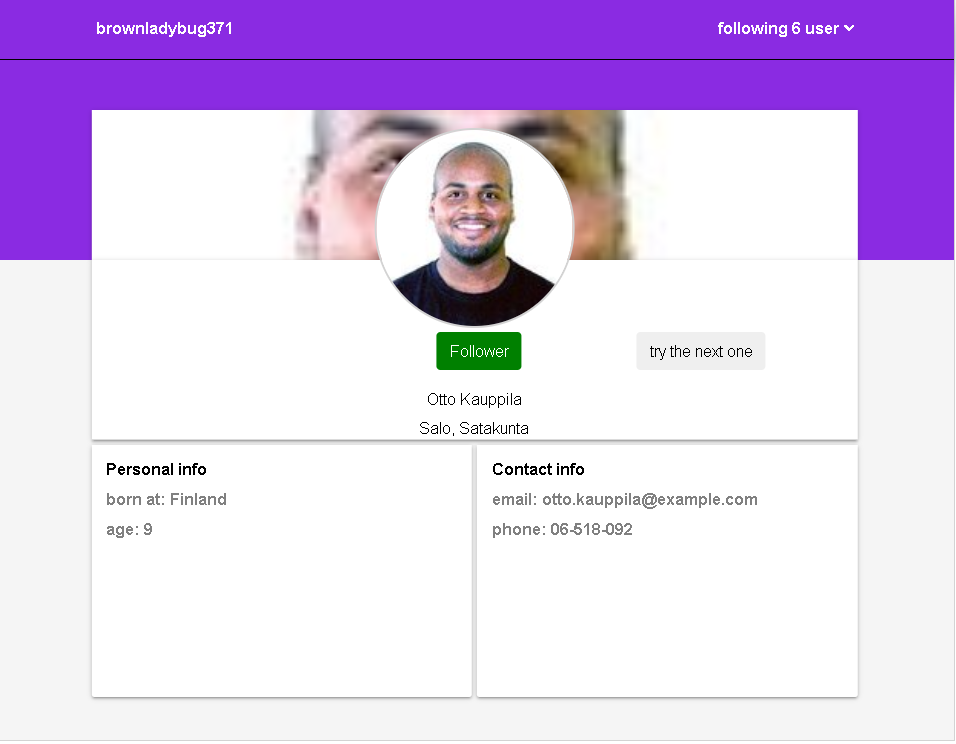

praticando um pouco com challenge do bw-2 

  
algumas features  
carrega paginas com as informações 
ao clicar no botão try the next, chama api carregando um novo usuario 
ao clicar em seguir cria uma lista exibindo a quantidade de pessoas que segue

